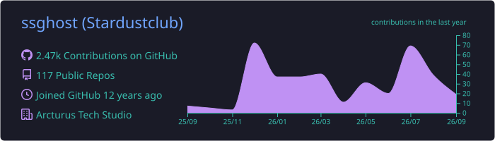
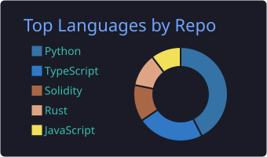
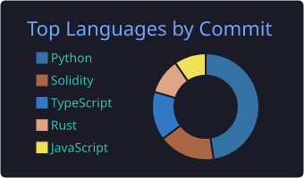

Hi! 👋  My name is Ssghost (StarDustClub)
==============================================================================================================================================

Independent Developer for Algorithms and Contracts.
-------------------------------------------

* 🌍  I preferred in working remotely.
  
* 🚀  Experienced Job Types:
   > 3 years Machine Learning Engineer
   > 3 years Crypto Contract Engineer
   > 3 years Crypto Quantitative Engineer
  
* 🚀  Expected Job Types:
   > Machine Learning Engineer, Quantitative Engineer, Crypto Contract Engineer, Crypto Contract Auditor
   > HongKong Onsite/Remote or Europe Remote/VISA supported On-site
  
* 🖥️  See my portfolio at:
   > [My Interactive Meta Portfolio](https://meta-portfolio-frontend.vercel.app)

### Skills

<table>
  <tr>
    <td align="center">
       
       
       
       
      
    </td>
    <td align="center">
       
       
       
       
      
    </td>
    <td align="center">
       
       
       
       
      
    </td>
    <td align="center">
       
       
       
       
      
    </td>
    <td align="center">
       
       
       
       
      
    </td>
  </tr>
</table>

### Skills Chart

  
   

  
  

### Socials

 <a href="https://www.dev.to/ssghost" target="_blank" rel="noreferrer"> <picture> <source media="(prefers-color-scheme: dark)" srcset="https://raw.githubusercontent.com/danielcranney/readme-generator/main/public/icons/socials/devdotto-dark.svg" /> <source media="(prefers-color-scheme: light)" srcset="https://raw.githubusercontent.com/danielcranney/readme-generator/main/public/icons/socials/devdotto.svg" />  </picture> </a> <a href="https://www.github.com/ssghost" target="_blank" rel="noreferrer"> <picture> <source media="(prefers-color-scheme: dark)" srcset="https://raw.githubusercontent.com/danielcranney/readme-generator/main/public/icons/socials/github-dark.svg" /> <source media="(prefers-color-scheme: light)" srcset="https://raw.githubusercontent.com/danielcranney/readme-generator/main/public/icons/socials/github.svg" />  </picture> </a> <a href="https://www.linkedin.com/in/shuangsongprofile" target="_blank" rel="noreferrer"> <picture> <source media="(prefers-color-scheme: dark)" srcset="https://raw.githubusercontent.com/danielcranney/readme-generator/main/public/icons/socials/linkedin-dark.svg" /> <source media="(prefers-color-scheme: light)" srcset="https://raw.githubusercontent.com/danielcranney/readme-generator/main/public/icons/socials/linkedin.svg" />  </picture> </a> <a href="https://www.x.com/sidham_song" target="_blank" rel="noreferrer"> <picture> <source media="(prefers-color-scheme: dark)" srcset="https://raw.githubusercontent.com/danielcranney/readme-generator/main/public/icons/socials/twitter-dark.svg" /> <source media="(prefers-color-scheme: light)" srcset="https://raw.githubusercontent.com/danielcranney/readme-generator/main/public/icons/socials/twitter.svg" />  </picture> </a>

### Support Me

<ul style="list-style-type: none; margin: 0;">

<li style="display: inline-block; margin-right: 0.25rem;"></li>
<li style="display: inline-block; margin-right: 0.25rem;"></li>
<li style="display: inline-block; margin-right: 0.25rem;"></li>

</ul>
